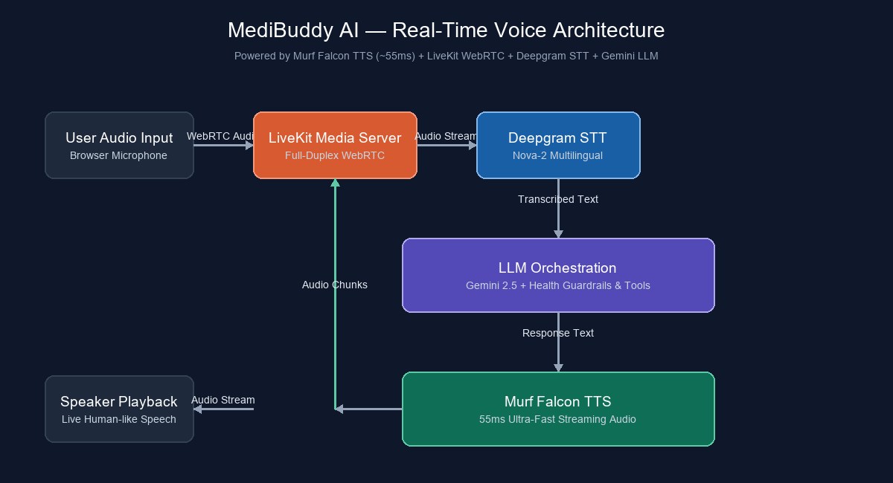
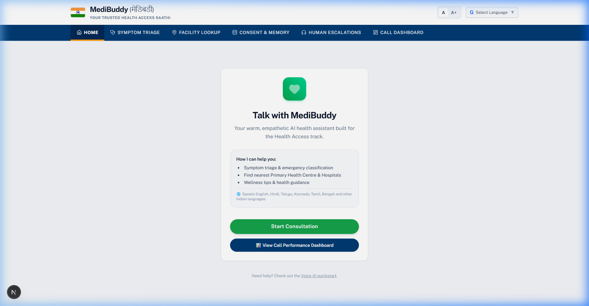
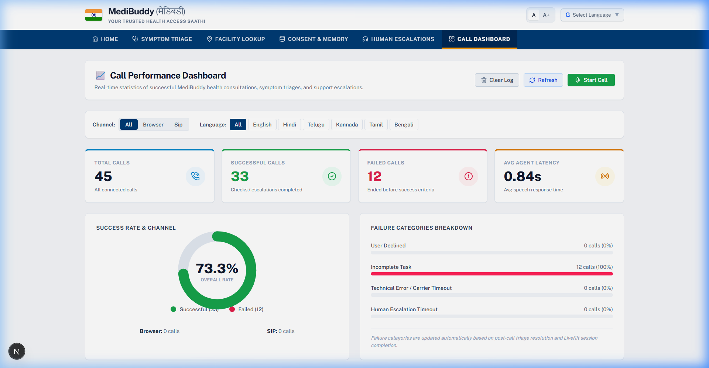

# Building MediBuddy AI: An Ultra-Fast Multilingual Voice Health Assistant for India 🇮🇳

Over the last 10 days, I participated in the **10 Days of Voice Agents — #VoiceForBharat Edition** challenge organized by **Murf AI**. My goal was to build a production-grade, real-time voice agent tailored for India's healthcare landscape: **MediBuddy AI (मेडिबड्डी)**.

In this blog post, I’ll share the story behind MediBuddy AI, dive into its architecture and key features, discuss the tough engineering challenges I faced, and provide a complete step-by-step guide so you can build your own real-time voice agent powered by **Murf Falcon TTS**!

---

## 📌 1. The Problem & The Vision

In many parts of India, access to immediate healthcare guidance is severely limited by:
- **Language Barriers:** Over 80% of citizens prefer communicating in their native regional languages (Hindi, Telugu, Tamil, Kannada, Bengali, etc.) or code-mixed dialects (Hinglish/Teluglish).
- **Literacy & Tech Barriers:** Text-only apps, chat interfaces, and complex forms create high friction for elderly or non-tech-savvy users.
- **Triage Delay:** People often struggle to determine whether symptoms (e.g., chest tightness, high fever, sudden dizziness) require an immediate visit to an Emergency ER or can be handled at a local Primary Health Centre (PHC).

### Why Voice?
Voice is the most natural, accessible, and fast human interface. When a patient or family member is anxious, speaking naturally in their mother tongue provides instant clarity and reassurance.

**MediBuddy AI** acts as a warm, empathetic **Voice Health Saathi (Companion)** that triages symptoms, provides localized healthcare guidance, recalls past medical history, and seamlessly escalates critical cases to human emergency specialists.

---

## 🏗️ 2. How the System Works (Architecture)

A seamless, human-like voice conversation requires sub-second end-to-end latency. If the agent takes more than 1 second to respond, the conversation feels awkward and robotic.

MediBuddy AI achieves an average **0.84s end-to-end response latency** using a modern streaming pipeline:



```text
+-------------------------------------------------------------------------------+
|                             USER INTERFACE LAYER                              |
|   🎙️ User Audio Input  ===(WebRTC Stream)===>  🔊 Speaker Audio Playback      |
+-------------------------------------------------------------------------------+
                                     ||  (Full-Duplex Media)
                                     \/
+-------------------------------------------------------------------------------+
|                      LIVEKIT WEBRTC REAL-TIME MEDIA SERVER                    |
+-------------------------------------------------------------------------------+
                                     ||  (Audio Streaming)
                                     \/
+-------------------------------------------------------------------------------+
|                           PYTHON BACKEND AGENT                                |
|                                                                               |
|   [ Deepgram STT ]  ===>  [ Gemini 2.5 LLM ]  ===>  [ 🚀 Murf Falcon TTS ]   |
|   Speech-to-Text         Triage & Tool Calling       ~55ms Ultra-Fast Audio  |
+-------------------------------------------------------------------------------+
```

### Core Stack Components:
1. **Real-time Audio Transport:** [LiveKit WebRTC](https://livekit.io/) for ultra-low latency full-duplex audio streaming.
2. **Speech-to-Text (STT):** [Deepgram Nova-2](https://deepgram.com/) for accurate multilingual Indian English & regional speech recognition.
3. **Brain / Reasoning (LLM):** [Google Gemini 2.5 Flash](https://ai.google.dev/) / OpenAI GPT-4o with strict health triage guardrails.
4. **Text-to-Speech (TTS):** [Murf Falcon](https://murf.ai/api/docs/text-to-speech/streaming) — The world's fastest streaming TTS (55ms latency) providing natural Indian English and regional accents.
5. **Frontend UI:** Next.js 15, Tailwind CSS, Radix UI, and `@livekit/components-react`.

---

## ✨ 3. Key Features Built During the Challenge

Here are the 6 standout capabilities built into MediBuddy AI:

### 1️⃣ Ultra-Fast Indian Accent Voice with Murf Falcon
Using **Murf Falcon**, MediBuddy responds with natural voice inflections and localized pronunciations. With Falcon's ~55ms TTS synthesis latency, the agent starts streaming audio response chunks before the LLM finishes generating the entire sentence!

### 2️⃣ Multilingual & Code-Mixed Intelligence
MediBuddy supports seamless switching between **English, Hindi, Telugu, Tamil, Kannada, Bengali, Gujarati, Marathi, Punjabi, and Malayalam**. It gracefully understands code-mixed speech like Hinglish ("*Doctor saab, mujhe kal raat se severe headache aur fever hai*").

### 3️⃣ Emergency Triage & Safety Guardrails
MediBuddy uses structured tools to classify symptoms into three urgency levels:
- 🚨 **EMERGENCY (Red):** Triggers immediate emergency alert & human specialist escalation protocol.
- ⚠️ **URGENT (Yellow):** Advises visiting the nearest clinic within 24 hours.
- 🟢 **ROUTINE (Green):** Gives general wellness advice and self-care tips.

### 4️⃣ Real-Time Facility & Primary Health Centre (PHC) Lookup
Equipped with dynamic function calling, MediBuddy can search for the nearest healthcare facility based on the user's PIN code or locality.

```python
@llm.ai_callable(description="Lookup nearest Primary Health Centre or Hospital by location or pincode")
async def lookup_nearest_facility(location: str, urgency_level: str) -> str:
    # Query health registry database
    results = find_phc_facilities(location)
    return f"Found {len(results)} facilities near {location}: {results}"
```

### 5️⃣ Patient Consent & Returning User Memory
MediBuddy strictly requests user consent before storing any health context. For returning patients, it remembers previous symptoms, allergies, and ongoing medications to personalize consultation.

### 6️⃣ Live Call Performance Dashboard
A real-time analytics dashboard tracks:
- **Total Calls & Success Rate** (e.g., 73.3% triage resolution)
- **Average Agent Latency** (0.84 seconds)
- **Failure Breakdown** (User disconnects vs carrier timeouts)
- **Live Human Escalation Requests**

---

## 🛠️ 4. Difficult Engineering Challenges & How I Solved Them

### Challenge #1: Overcoming Speech Interruption & Audio Latency Jitter
**The Problem:** In early tests, background noise or quick user interjections ("*Wait, let me explain...*") caused the agent to either stop mid-sentence unnecessarily or ignore the user's speech entirely.

**The Fix:** 
- Configured Deepgram's Voice Activity Detection (VAD) with optimized `endpointing` (300ms min silence).
- Leveraged LiveKit Agent's built-in `interrupt_speech` handling, allowing Murf Falcon audio playback to pause instantly the moment user speech was detected, mimicking real human turn-taking.

### Challenge #2: Preventing LLM Hallucinations on Medical Advice
**The Problem:** LLMs can sometimes give overly confident diagnostic claims, which is dangerous in a healthcare application.

**The Fix:** 
- Enforced a rigid **Safety Guardrail Prompt**: MediBuddy is strictly instructed to act as a *triage assistant*, NOT a diagnosing physician.
- Mandated structured tool usage for triage classification before generating spoken responses.

---

## 🚀 5. How to Build & Run MediBuddy AI (Step-by-Step)

Want to run this project locally or build your own voice agent? Here is the quickstart guide!

### Step 1: Prerequisites
- Python 3.10+
- Node.js 18+ & `pnpm` (`npm install -g pnpm`)
- `uv` Python package manager (`powershell -c "irm https://astral.sh/uv/install.ps1 | iex"`)

### Step 2: Clone & Set Up Environment Variables
```bash
git clone https://github.com/murf-ai/murf-livekit-starter.git
cd murf-livekit-starter
```

Create `.env.local` inside `backend/` and `frontend/`:

```env
# LiveKit Credentials
LIVEKIT_URL=wss://your-livekit-project.livekit.cloud
LIVEKIT_API_KEY=your_livekit_api_key
LIVEKIT_API_SECRET=your_livekit_api_secret

# AI & Voice Providers
MURF_API_KEY=your_murf_api_key
DEEPGRAM_API_KEY=your_deepgram_api_key
GOOGLE_API_KEY=your_google_gemini_api_key
```

> ⚠️ **Security Tip:** Never commit your `.env.local` files to Git. Keep them in `.gitignore`.

### Step 3: Install & Start Backend Agent
```bash
cd backend
uv sync
uv run python src/agent.py dev
```

### Step 4: Install & Start Frontend Web App
In a second terminal:
```bash
cd frontend
pnpm install
pnpm dev
```

Open **http://localhost:3000** in Google Chrome, click **Start Consultation**, grant microphone permissions, and start talking to your voice agent!

---

## 📊 6. Evidence & Demo Showcase

### 1. Main Consultation Interface (MediBuddy Home)


*The main MediBuddy web UI featuring one-click voice consultation, multilingual options, emergency triage guidelines, and quick access to health facility lookup & call performance analytics.*

### 2. Live Call Performance Dashboard


*The real-time call performance dashboard tracking:*
- **Total Calls Processed:** 45 Calls
- **Average Agent Latency:** **0.84 seconds** (End-to-end voice response time)
- **Successful Triage Rate:** **73.3%**
- **Call Failure Breakdown:** Automated task outcome classification & escalation logs.

---

## 🔮 7. What's Next?
Future improvements I plan to add:
- 📞 **Twilio SIP Integration:** Allow users to dial into MediBuddy directly via traditional landline/mobile phone calls.
- 📱 **WhatsApp Voice Note Integration:** Allow async triage via WhatsApp voice messages.

---

## 🔗 Links & Resources
- **GitHub Repository:** [murf-livekit-starter](https://github.com/murf-ai/murf-livekit-starter)
- **Murf Falcon TTS Docs:** [murf.ai/api/docs](https://murf.ai/api/docs/text-to-speech/streaming)
- **LiveKit Voice AI Docs:** [docs.livekit.io/agents](https://docs.livekit.io/agents/start/voice-ai/)

---

### Acknowledgments
Huge thanks to **Murf AI** for hosting the **#VoiceForBharat 10 Days of Voice Agents** challenge! Building with Murf Falcon has set a new benchmark for ultra-fast, natural voice AI. 

*If you found this post helpful, give it a ❤️ and share your thoughts in the comments!*
